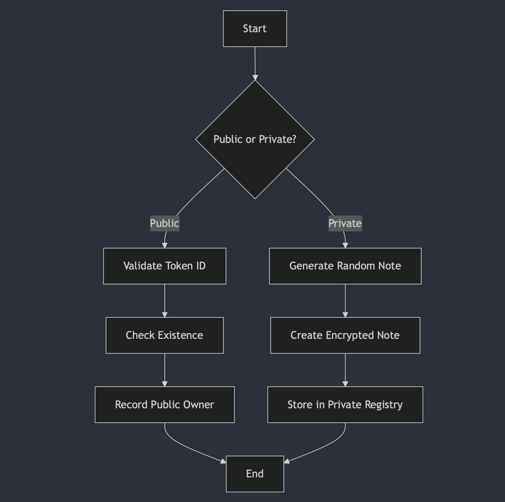
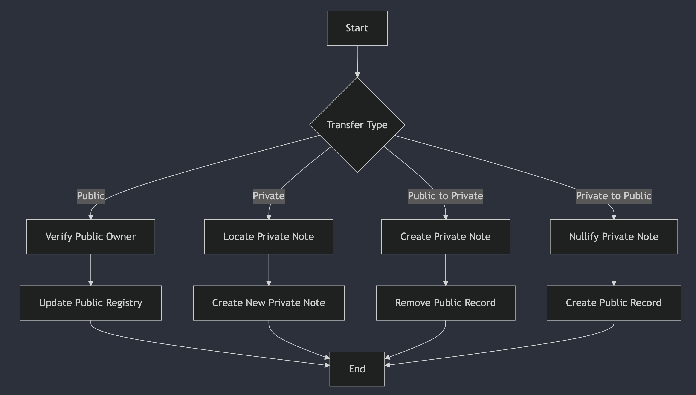

# NFT Contract Documentation

## Overview
The NFT contract is implemented as a privacy-enabled smart contract that supports both public and private NFT operations. It allows users to mint, transfer, and manage NFTs with privacy features using the Aztec protocol.

## Contract Structure

### Storage Layout
```rust
struct Storage<Context> {
    symbol: PublicImmutable<FieldCompressedString, Context>,
    name: PublicImmutable<FieldCompressedString, Context>,
    admin: PublicMutable<AztecAddress, Context>,
    private_nfts: Map<AztecAddress, PrivateSet<NFTNote, Context>, Context>,
    nft_exists: Map<Field, PublicMutable<bool, Context>, Context>,
    public_owners: Map<Field, PublicMutable<AztecAddress, Context>, Context>,
}
```

### NFT Note Structure
```rust
struct NFTNote {
    token_id: Field,          // ID of the token
    owner: AztecAddress,      // The owner of the note
    randomness: Field,        // Randomness to hide contents
}
```

## Core Features

### 1. Initialization
- Constructor initializes the contract with:
  - Admin address
  - NFT collection name (31 chars max)
  - NFT symbol (31 chars max)

### 2. Minting Capabilities

#### Public Minting
```rust
fn mint(to: AztecAddress, token_id: Field)
```
- Mints a new NFT publicly
- Validates token ID is not zero
- Checks token doesn't already exist
- Assigns ownership in public registry

#### Private Minting
```rust
fn private_mint(to: AztecAddress, token_id: Field)
```
- Mints a new NFT privately
- Creates encrypted note for the recipient
- Uses randomness for privacy
- Stores in private NFT registry

### 3. Transfer Operations

#### Public Transfers
```rust
fn transfer_in_public(from: AztecAddress, to: AztecAddress, token_id: Field, nonce: Field)
```
- Transfers NFT between public addresses
- Requires ownership verification
- Supports authorized transfers (via authentication witness)

#### Private Transfers
```rust
fn transfer_in_private(from: AztecAddress, to: AztecAddress, token_id: Field, nonce: Field)
```
- Transfers NFT between private addresses
- Uses encrypted notes for privacy
- Validates ownership through note nullification

#### Cross-Mode Transfers

1. Public to Private
```rust
fn transfer_to_private(to: AztecAddress, token_id: Field)
```
- Converts public NFT to private
- Creates encrypted note for recipient
- Removes from public registry

2. Private to Public
```rust
fn transfer_to_public(from: AztecAddress, to: AztecAddress, token_id: Field, nonce: Field)
```
- Converts private NFT to public
- Nullifies private note
- Records in public registry

### 4. Ownership Management

#### Public Ownership
- Tracked in `public_owners` mapping
- Directly queryable through `owner_of` function
- Transparent ownership records

#### Private Ownership
- Managed through encrypted notes
- Uses `NFTNote` structure for ownership
- Provides privacy through encryption and randomness

### 5. Authorization System
- Supports delegated transfers through authentication witnesses
- Includes nonce-based replay protection
- Allows cancellation of authentication witnesses

## Privacy Features

### 1. Note Structure
- Uses encrypted notes for private ownership
- Includes randomness for hiding contents
- Implements nullifiable note interface

### 2. Privacy Mechanisms
- Encrypted logs for note transfer
- Hidden ownership information
- Private balance tracking

## Flow Diagrams

### Minting Flow


### Transfer Flow



## Security Considerations

1. **Ownership Validation**
   - Strict ownership checks before transfers
   - Authentication witness system for delegated operations
   - Nonce-based replay protection

2. **Privacy Protection**
   - Encrypted note system
   - Randomness in note creation
   - Private balance tracking

3. **Administrative Controls**
   - Admin role for contract management
   - Immutable name and symbol
   - Upgradeable admin address

## Testing Coverage

The contract includes extensive test coverage for:
- Public and private minting
- All transfer scenarios
- Authorization and ownership validation
- Error cases and edge conditions
- Authentication witness functionality

This documentation provides a comprehensive overview of the NFT contract implementation, its features, and security considerations. The contract combines traditional NFT functionality with privacy features enabled by the Aztec protocol. 